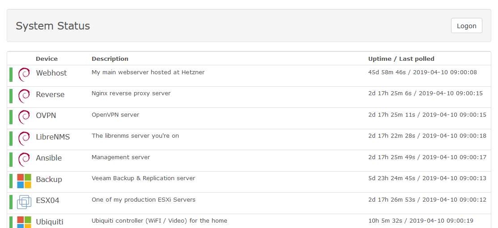

LibreNMS Public status page
===========================

## About this
This is an example for customizing the LibreNMS Public Status Page

## Dependencies
None

## Tested on
Latest LibreNMS release in April 2019 with PHP 7.1.

## Installation

```bash
cd /opt/librenms/resources/views/auth/
mv public-status.blade.php public-status.blade.php.old
wget https://raw.githubusercontent.com/stylersnico/LibreNMS-publicstatus/master/public-status.blade.php
```


Add this to ```/opt/librenms/config.php```

```php
$config['public_status']    = true;
```

## Sample


